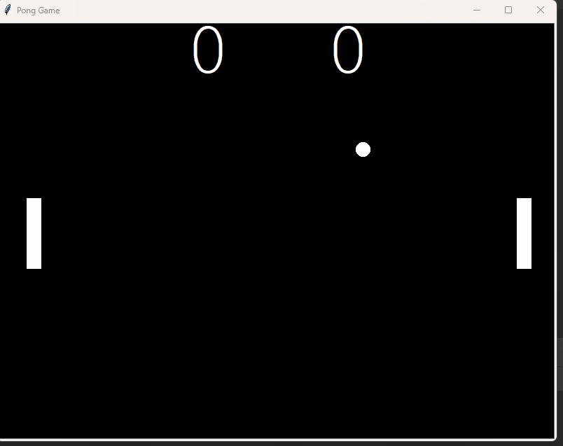

## 🏓 Pong Game in Python (Turtle Graphics)

A classic Pong game implementation using Python Turtle graphics, featuring two-player paddle controls, ball physics, and a live scoreboard.

# Overview

This project recreates the classic Pong arcade game using Python’s built-in turtle module.

It includes real-time paddle movement, ball collision mechanics, score tracking, and increasing difficulty over time.

## Demo

*Two-player pong with collision physics and dynamic speed increase*

# Features
* Two-player paddle control (keyboard-based)
* Ball collision with walls and paddles
* Score tracking system
* Ball speed increases after paddle hits
* Reset and score update when a player misses
* Smooth animation using screen.tracer()

# Tech Stack
* Language: Python
* Library: turtle
* Tools: VS Code / PyCharm, Git

# Project Structure

pong-game/

│── main.py

│── paddle.py

│── ball.py

│── scoreboard.py

│── README.md

Installation

# Clone the repository:

git clone https://github.com/your-username/pong-game.git

cd pong-game

# Run the game:

python main.py

No external libraries required. Python’s turtle module is included by default.

# Controls

Player&nbsp;&nbsp;&nbsp;&nbsp;&nbsp;&nbsp;&nbsp;&nbsp;Move Up&nbsp;&nbsp;&nbsp;Move Down

Left Paddle&nbsp;&nbsp;&nbsp;&nbsp;&nbsp;W&nbsp;&nbsp;&nbsp;&nbsp;&nbsp;&nbsp;&nbsp;&nbsp;&nbsp;&nbsp;&nbsp;S

Right Paddle	Up Arrow	Down Arrow

# Gameplay Rules

The ball bounces off paddles and walls.

If a player misses the ball, the opponent scores a point.

Ball speed increases after every paddle hit.

# Output Example

Score displayed at the top of the screen

Ball resets to center after scoring

Continuous gameplay until window is closed

# Future Improvements

Add sound effects

Implement AI paddle for single-player mode

Add winning score condition

Add pause and restart functionality

Improve paddle physics (angle-based reflection)

# Known Issues

Paddle class contains unused snake-game logic (segments, extend, etc.)

Ball speed can become too fast over time

No game-over state
